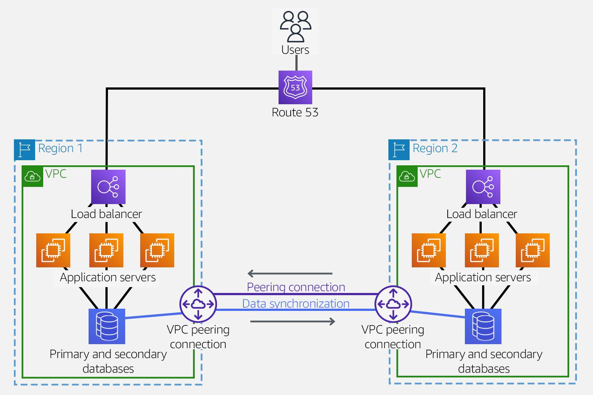

# Some Design patterns

## Simplifying Multi-VPC routing

- One transit gateway replaces all five VPC peering connections.
- All routing tables are centralized on the transit gateway, simplifying management
- The number of VPN connections is reduced to one
- The Direct Connect connection terminates on the transit gateway

## Hybrid networks

- Direct Connect gateway has 99.99 availability 
- a second rack added to the Direct Connect partner, removing a sigle point of failure
- a second physical WAN circuit helps reduce the chance of interruption

## Regional High availability

- route 53 offers DNS health checks to route traffic to healthy endpoints
- Inter-region VPC peering lets you share resources or replicata data between regions without existing AWS Backbone

## Transit Gateway peering

- transit gateway inter region peering is one-to-one connection between 2 transit gateways
- transit peering is not supported:
    - This means that traffic routing between Regions can only pass from the transit gateway in the originating Region to the transit gateway in the destination Region
- no peering relationship with a transit gateway that your transit gateway is not directly peered with