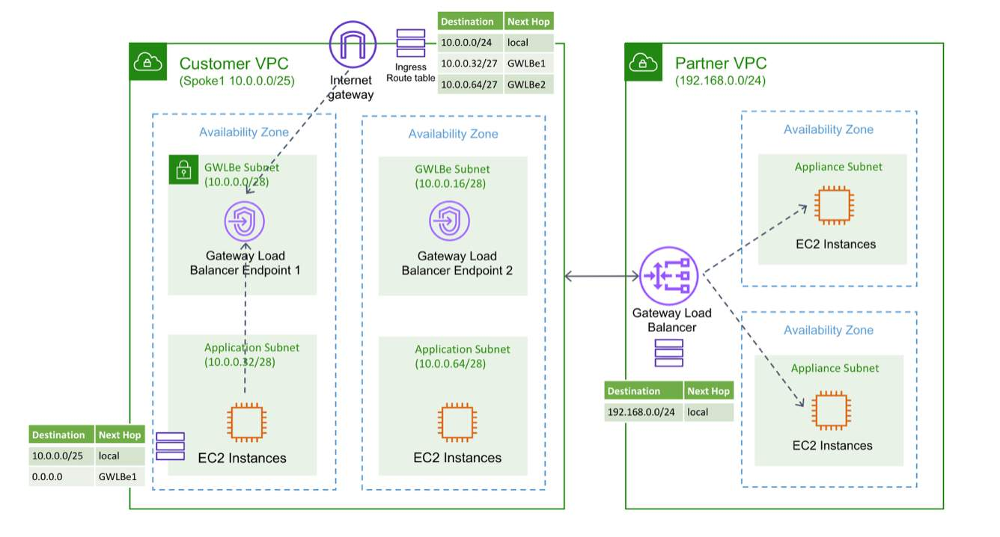

# Load balancing

Classic Load Balancer

-  not recommended for use unless you have legacy services or applications

Application Load Balancer

- layer 7 load balancer (application layer, namely HTTP and HTTPs.)
- can then take actions based on things in that protocol such as paths, headers, and hosts
- can be:
    - internet facing: will have public IP addresses 
    - internal: will have private IP addresses
- billed at an hourly rate 

Network Load Balancer

- does not need to worry about the upper layer protocol and it is much faster
- support all other protocols and can handle millions of requests

Gateway Load Balancer

- operates at the third layer of the Open Systems Interconnection (OSI) model, the network layer
- listens for all IP packets across all ports and forwards traffic to the target group that's specified in the listener rule
- maintains stickiness of flows to a specific target appliance using 5-tuple (for TCP/UDP flows) or 3-tuple (for non-TCP/UDP flows)
- exchange application traffic using the GENEVE protocol on port 6081
- supports a maximum transmission unit (MTU) size of 8,500 bytes.
- use Gateway Load Balancer endpoints to securely exchange traffic across VPC boundarie

- Traffic to and from a Gateway Load Balancer endpoint is configured using route tables.
- Traffic flows from the service consumer VPC over the Gateway Load Balancer endpoint to the Gateway Load Balancer in the service provider VPC, and then returns to the service consumer VPC. 
- You must create the Gateway Load Balancer endpoint and the application servers in different subnets.
- This lets you to configure the Gateway Load Balancer endpoint as the next hop in the route table for the application subnet.

