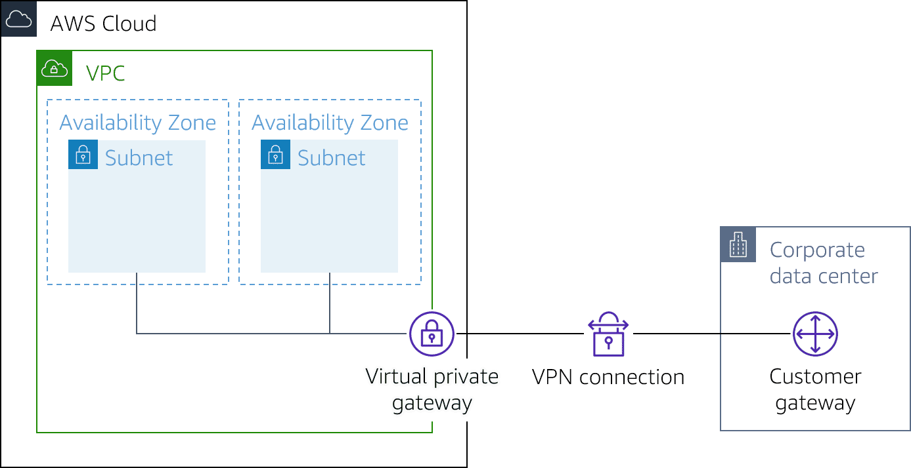

# Site to Site VPN & AWS Client VPN

## Site to site VPN

- based on IPsec tech, uses VPN tunnel to pass data from Customer Network to or from AWS

### Components
- customer gateway: represents your on-premise gateway device.
- customer gateway device: physical device or software app on your side
- virtual private gateway: VPN concentrator on AWS side
- transit gateway: transit hub that can be used to interconnect your VPCs and on-premises networks.

(use Virtual Private Gateway or Transit Gateway)

### Limitations
- IPV6 is partially supported
- does not support Path MTU discovery
- throughput is limited
- maximum packets per second is 140000
- terminating on AWS Transit Gateway supports equal-cost multi-path routing (ECMP) and multi-exit discriminator (MED) across tunnels in the same and different connection. 
- endpoints use public IPv4 addresses and therefore require a public virtual interface to transport traffic over Direct Connect
- For globally distributed applications, the accelerated Site-to-Site VPN option provides a connection to the global AWS backbone through AWS Global Accelerator

### Monitoring
Use CloudWatch (up to 15 months)

### Pricing
- connection per hour
- Data transfer out charges

#### Accelerated site to site VPN
- connection per hour
- Data transfer out charges 
- Hourly charges for two AWS Global Accelerators per VPN connection
- Data Transfer Out Premium

## Client VPN
Based on OpenVPN technology

- Client VPN endpoint: Your Client VPN administrator creates and configures a Client VPN endpoint in AWS.
- VPN client application: oftware application that you use to connect to the Client VPN endpoint 
- configuration file that is provided to you by your Client VPN administrator

### Limitations
- supports IPv4.
- does not support IPv6
- SAML 2.0-based federated authentication only works with an AWS provided client v1.2.0 or later. 
- SAML integration with AWS Single Sign-On requires a workaround. 
- Client CIDR ranges must have a block size of at least /22 and must not be greater than /12
- A Client VPN endpoint does not support subnet associations in a dedicated tenancy VPC
- Client VPN is not compliant with Federal Information Processing Standards (FIPS).
- Client CIDR ranges cannot overlap with the local CIDR of the VPC in which the associated subnet is located
- A portion of the addresses in the client CIDR range is used to support the availability model of the Client VPN endpoint and cannot be assigned to clients.
- The client CIDR range cannot be changed after you create the Client VPN endpoint.
- The subnets associated with a Client VPN endpoint must be in the same VPC
- You cannot associate multiple subnets from the same Availability Zone with a Client VPN endpoint
- AWS Certificate Manager (ACM) certificates are not supported with mutual authentication because you cannot extract the private key
- You can use an ACM server as the server-side certificate

### Monitoring
- end user usage reporting through CloudWatch
- You can use a client connect handler to do basic posture assessment with Lambda because Client VPN does not support native posture assessment.
- Client VPN publishes metrics to CloudWatch for your Client VPN endpoints (every 5 minutes)

### Pricing
- active client connections per hour & number of subnets associated