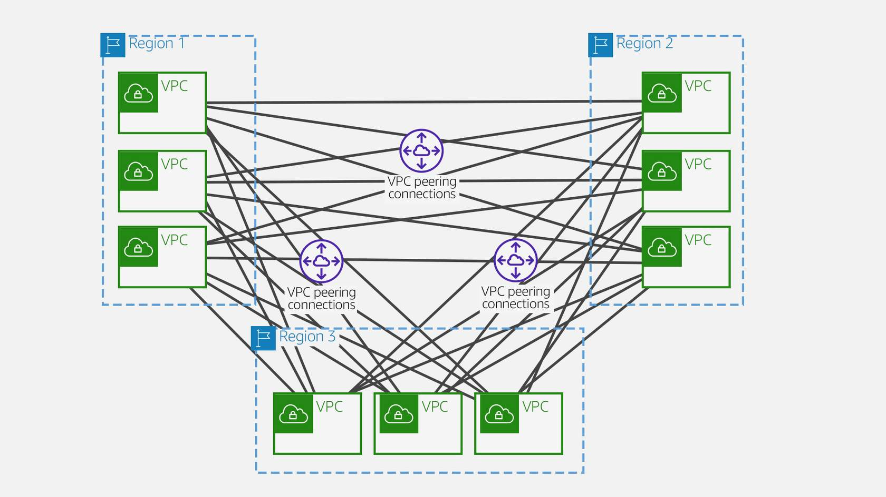
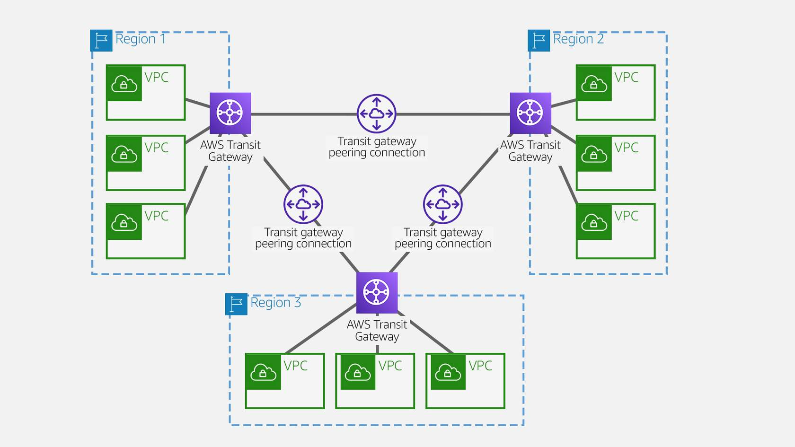

# Transit gateway

Provides a method for consolidating and centrally managing routing between VPCs with a hub-and-spoke network architecture

## Concepts
- attachments (one of):
    - one or more VPC's
    - compatible SD-WAN appliance
    - a direct connect gateway
    - a peering connection with another Transit Gateway
    - a VPN connection to a Transit Gateway
- Transit Gateway MTU
    - 8.500 bytes, for:
        - VPC connections
        - Direct Connect connections
        - Connections to other Transit gateway
        - Peering connections
    - 1500 bytes
        - VPN Connections
- Transit Gateway route table
    - has a default route table
    - can optionally have additional route tables
    - a route table includes dynamic and static routes. Use destination IP address of the packet
    - target can be any attachment
- associations:
    - each attachment is associated with exactly one route table
    - each route table can be associated with zero to many attachments
- route propagation:
    - VPC, VPN or Direct connect gateway can dynamically propagate routes to a transit gateway route table
        - done by default: Direct connect
        - must create: VPC
        - use BGP: VPN connection or Direct Connect gateway
        - must create static route: peering attachment

## Inter regional peering

Two types of peering connections for routing traffic between VPCs in different Regions:
- VPC peering
- transit gateway peering

## Pricing
- number of connections per hour 
- Gb of data processed