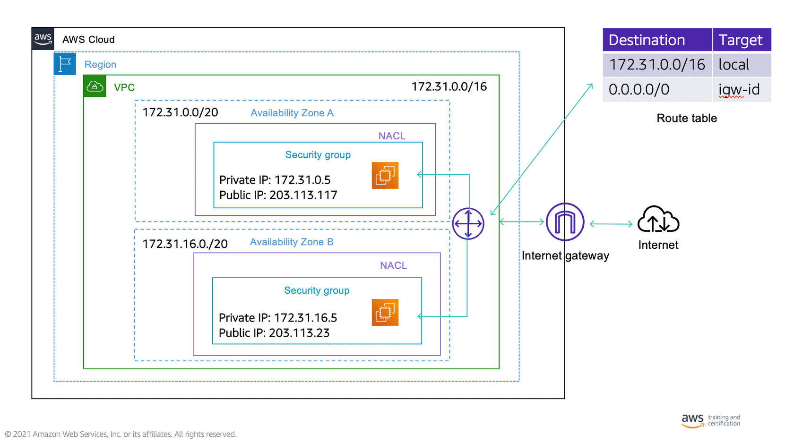
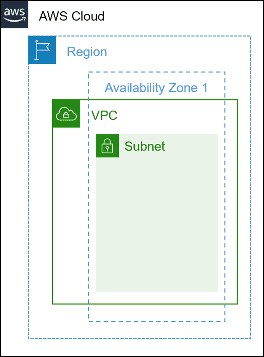
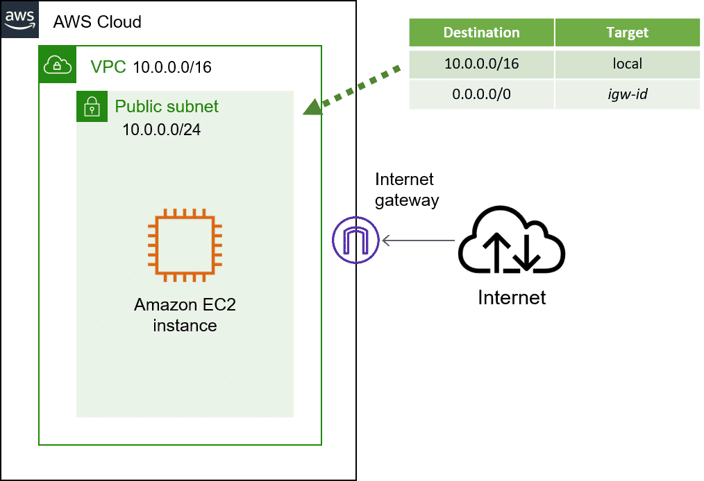

# VPC

## Default
Configured initially:
- with /16 IPv4
- /20 subnet (provides up to 4096 addreses!)
- an internet gateway (allows public access)
- a default route to the IG (allows all trafic)
- a default SG
- a default NACL
- a default Dynamic Host Configuration protocol (DHCP)

## Features

- a single VPC can't live in more than one region
- it can span more than one AZ within the same regoin
- a subnet is restricted to one AZ 
- route a subnet to an Internet Gateway -> subnet becomes public subnet
    - IG scale horizontally
    - IG are redundant
    - IG are highly availably
- roube tables direct traffic to targets based on the IP address the traffic is seeking 
    - 
    - first row takes all traffic from that subnet and routes it within the Amazon VPC 
    - second row takes all traffic coming from that subnet and directs it to the internet gateway 
    - because 10.0.0.0/16 is a more specific range than 0.0.0.0/0, the route table knows to direct all of that traffic to local, overriding the route in the second row
- The only architectural difference between a public and private subnet is that a public subnet has a route to an internet gateway.
- By default, DNS is handled by Amazon VPC. It is possible, however, to use Amazon Route 53 to create your own DNS inside an Amazon VPC with private hosted zone
- All traffic is unicast and Amazon VPCs do not require the Address Resolution Protocol (ARP)
- By default, all subnets in an Amazon VPC can access each other. You can use network network ACLs to restrict traffic into and out of your subnets
- All traffic between two points in the same Amazon VPC is forwarded directly.

## Best Practices
https://docs.aws.amazon.com/vpc/latest/userguide/vpc-security-best-practices.html

- When you add subnets to your VPC to host your application, create them in multiple Availability Zones
- Use security groups to control traffic to EC2 instances in your subnets. 
- Use network ACLs to control inbound and outbound traffic at the subnet level
