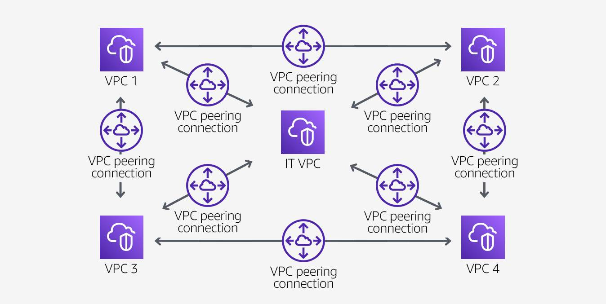

# VPC peering

## Benefits
- highly available
- inter-Region VPC peering: between VPCs across different AWS Regions
- All inter-Region traffic is encrypted with no single point of failure or bandwidth bottleneck
- Traffic always stays on the global AWS backbone and never traverses the public internet
- can also create a VPC connection between VPCs in different AWS accounts

## Scenarios

Sharing resources between all VPC's

Each VPC must have a one-to-one connection with each VPC it is approved to communicate with
VPC peering connection is nontransitive in nature and does not allow network traffic to pass from one peering connection to another.

Partial Sharing resources

A central VPC for file sharing + 
but do not need to send traffic to each other.

## Non valid peering configurations
- overlapping CIDR blocks:  You cannot create a VPC peering connection if the VPCs have matching or overlapping IPv4 CIDR blocks (IPv6 too)
- transitive peering: You have a VPC peering connection between VPC A and VPC B, and between VPC A and VPC C. There is no VPC peering connection between VPC B and VPC C. You cannot route packets directly from VPC B to VPC C through VPC A.
- if either VPC in a peering relationship has one of the following connections, you cannot extend the peering relationship to that connection:
    - a VPN connection or a Direct connect connection to a corporate Network
    - an internet connection through an Internet Gateway
    - an internet connection in a private subnet though a NAT Device
    - a Gateway VPC endpoint to an AWS service (s3, for example)

## Pricing
There is no charge for setting up or running a VPC peering connection. Data transferred across peering connections is charged per gigabyte for send and receive, regardless of the Availability Zones involved.