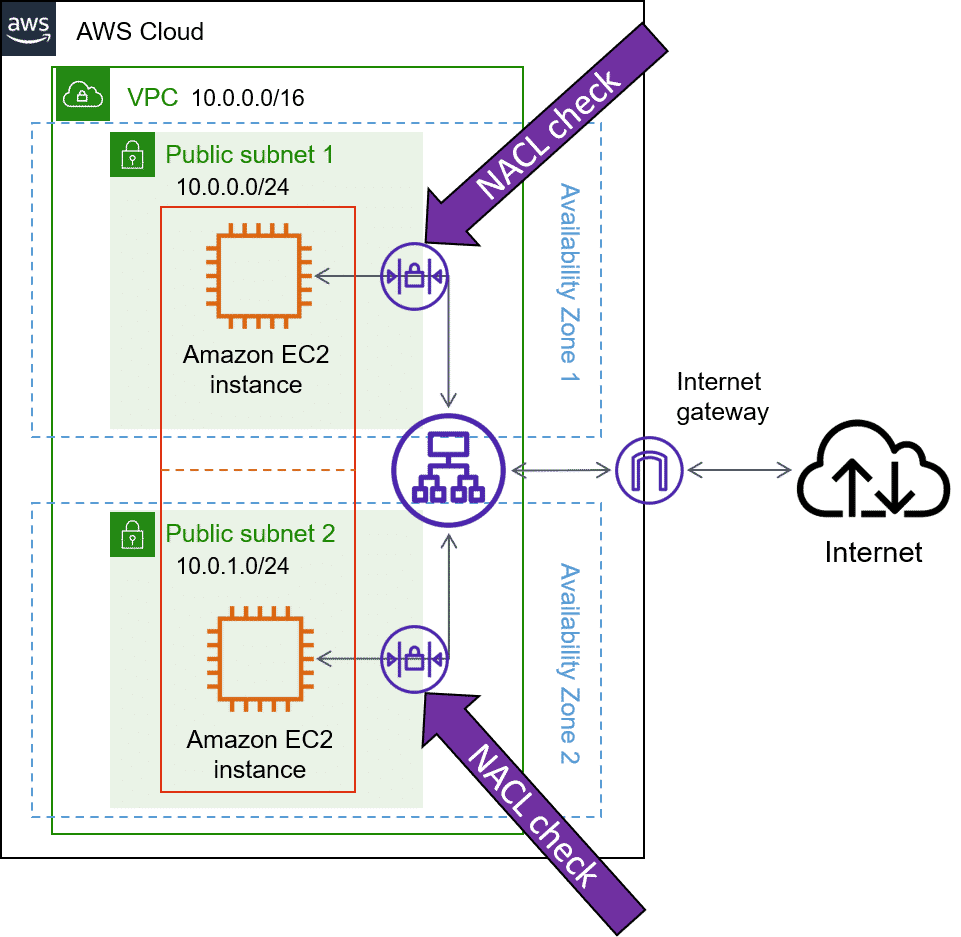
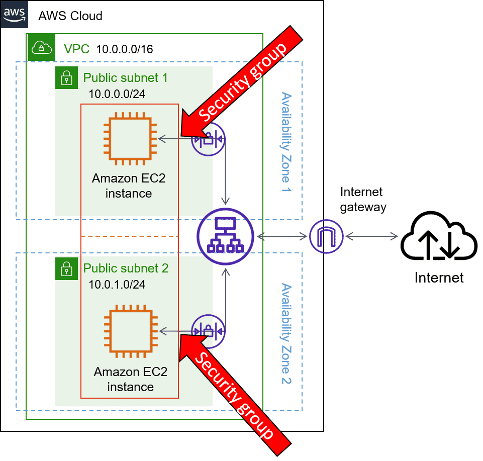

# VPC Security

## Subnet boundary: Network ACLs 
-  The default network ACL only applies to subnets it is

## Instance boundary: Security groups
- Operate at the AWS resource level
- Security groups are just groups of rules applied to each instance separately

## VS

| NACL | Security Group |
| --- | --- |
| subnet level | AWS resources level (ENI's) |
| Stateless  | Stateful |
| two rules are needed: Network ACLs see the traffic as two different streams | Security groups see both the inbound and outbound traffic as part of the same stream |
| inbound and outbound address and port will need to be explicitly added. | if traffic is allowed in, that traffic is automatically allowed back out |
| don't recognize AWS resources | recognize AWS resources |
| | a hidden explicit deny |

## VPC Flow logs
- capture information about IP traffic going to and from Network Interfaces in your VPC
-  you can designate an Amazon S3 bucket to store them in.

## Chaining together security groups
- allow por 22 access to evert tier for administration
- only allow web servers 80 & 443
- Your application servers would only allow traffic that originated from the web server security group.
- Your database servers would only allow traffic that originated from the application server security group