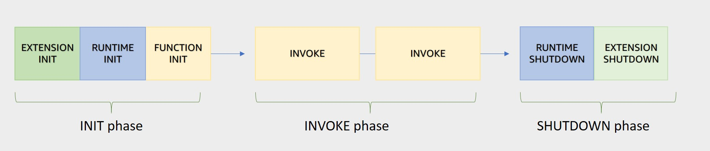
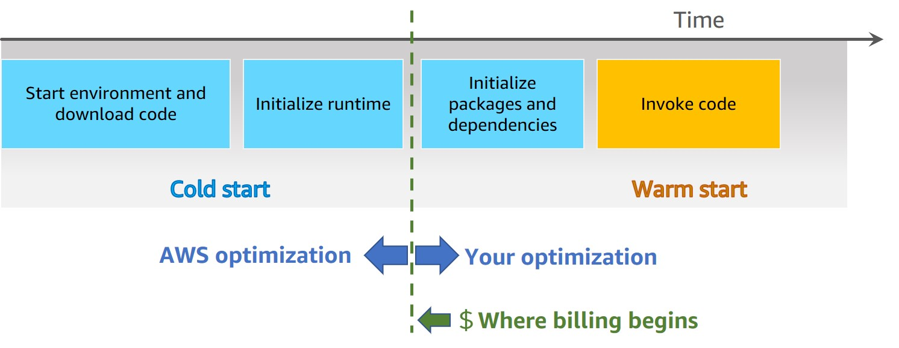

# Lambda

## Features

### sync invocation
- Amazon API Gateway
- Amazon Cognito
- AWS CloudFormation
- Amazon Alexa
- Amazon Lex
- Amazon CloudFront

### async
- Amazon SNS 
- Amazon S3
- Amazon EventBridge 

### polling invocation

| Polling | Event source |
| --- | --- |
| Amazon Kinesis | Amazon DynamoDB |
| Amazon SQS | Amazon Kinesis |
| Amazon DynamoDB Streams | Amazon MQ |
|  | Amazon Managed Streaming for Apache Kafka (MSK) |
|  | self-managed Apache Kafka |
|  | Amazon SQS |

# Execution enviornment lifecycle

- init phase
    - extension init (starts all extensions)
    - runtime init (boostraps the runtime)
    - function init (runs the function static code)
- invoke phase (invokes the function handler)
- shutdown phase

