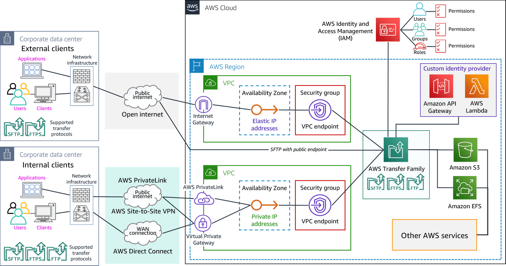
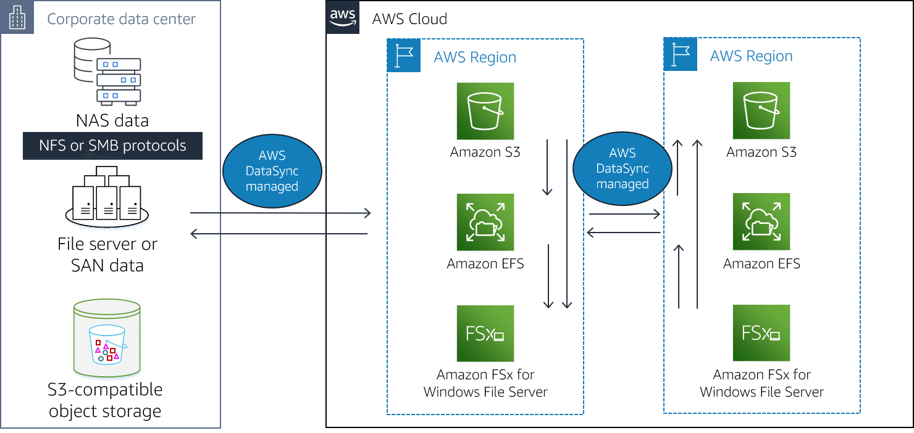

# Storage

## Transfer data to Cloud

### Transfer family

#### Use cases
- Sharing and receiving files internally and with third parties
- Data distribution made secure and easy
- Sharewd data lakes

### DataSync

#### Features
- DataSync comes with a built-in scheduling mechanism. 
- In addition to integrations with Amazon S3, Amazon EFS, and Amazon FSx for Windows File Server, DataSync supports VPC endpoints to move files directly into your Amazon VPC. 
- With Amazon CloudWatch, you can monitor the status of any DataSync transfers currently in progress and check the history of previous data transfers. With CloudWatch Metrics, you can see the number of files and the amount of data that has been copied. 

#### Use Cases
- Data Migration: Use DataSync to make an initial copy of your entire dataset and to schedule subsequent incremental transfers of changing data until the final cutover to AWS. 
- Data Protection:  you can replicate files into any Amazon S3 storage class, selecting the most cost-effective storage class for your needs
- Archive cold data: , you can move this data directly to durable and secure long-term storage such as Amazon S3 Glacier or Amazon S3 Glacier Deep Archive. 
- Data processiong for edge and hybrid workloads: If you have on-premises systems generating or using data that needs to move between on premises and AWS for processing, you can use DataSync to speed up your critical hybrid workflows. 