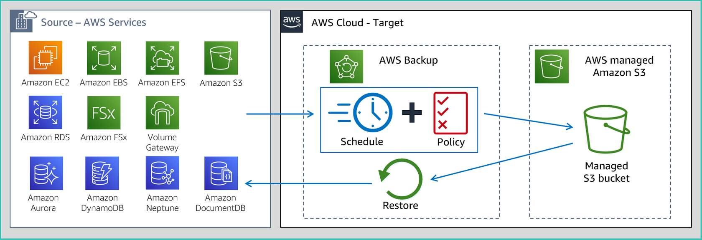

# Protecting Data

## AWS Backup

### Features
- Centralized backup management
- Policy based backup: create backup policies called backup plans
- automated backup scheduling: a backup schedule includes the backup start time, backup frequency, and backup window
- Automated retention management: backup retention policies that will automatically retain and expire backups 
- Lifecycle management policies: configure lifecycle policies that will automatically transition backups from warm storage to cold storage according to a schedule
- Incremental backups: The first backup of an AWS resource backs up a full copy of your data. For each successive incremental backup, only the changes to your AWS resources are backed up
- Cross region backup: can also recover from those backups in the new Region,
- Cross account management and bakcup:  copy backups to different trusted destination accounts in your organization.
- Backup activity monitoring: also integrates with SNS
- Secure data: esource-based access policies to access backups
- Compliance: SOC 1,2,3, GDPR, PCI

### Use Cases
- Amazon EBS, Amazon RDS, Amazon DynamoDB, Amazon EFS, Amazon FSx, Amazon EC2, AWS Storage Gateway
- Hybrid:  integrates with AWS Storage Gateway

## Snapshots

### Features
- Different than Backup
- Amazon EBS 
    - to S3
    - incremental
    - deleting snapshot only removes the unique part
    - tracked in CloudWatch
- Amazon FSx for Lustre
    - to S3
    - incremental
    - must take your manual backup when your automatic backup is not running.
 
### Use Cases
- Snapshots are stored in a protected part of Amazon S3 as part of the managed service.

## CloudEndure

### Features
- Uses EBS as storage
- Continuous replication: sync/async recovery into staging area.
- Low cost staging area: educes the need for duplicate resources and significantly reduces your disaster recovery total cost of ownership (TCO)
- Automated machine conversion and orchestration:  triggers a highly automated machine conversion process and a scalable orchestration engine
- Point in time recovery: recover applications and IT environments that have been corrupted
- Non disruptive disaster recovery testing: conduct disaster recovery drills without disrupting your source environment
- Wide support
