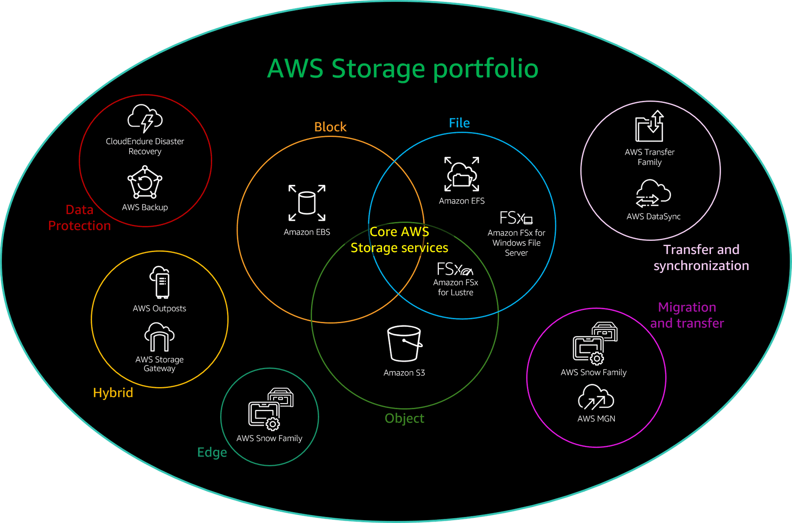

# Storage Portfolio

## EBS

### Features
- Single AZ. Next to EC2
- same as direct attached volumes
- HDD or SSD
- pay for the provisioned size, type, and provisioned performance
- integrated snapshots
### Use Cases

## EFS

### Features
- Regional service & multiple AZ
- pay only for the storage that you consume.
- Integrates with AWS DataSync and AWS Transfer Family for transfer workloads
- Integrates with Amazon EC2, AWS Lambda, Amazon Elastic Container Service (Amazon ECS), and Amazon Elastic Kubernetes Service (Amazon EKS) for compute processing

### Use Cases

## FSx for Windows File Server

### Features
- SMB protocol
- You pay for the capacity that you provision.
- Integrates with AWS DataSync for transfer workloads.

### Use Cases

## FSx for Lustre

### Features
- for high-performance computing environments
- pay for the provisioned capacity and the provisioned performance characteristics.
- Integrates with Amazon EC2, AWS Lambda, Amazon Elastic Container Service (Amazon ECS), and Amazon Elastic Kubernetes Service (Amazon EKS) for compute processing

### Use Cases

## S3

### Features
- across multiple Availability Zones by default
- pay for the capacity you use plus access charges.
- Cross-Region Replication for increased availability.
- S3 buckets are globally unique 
- S3 supports individual file sizes up to 5 TB.

### Use Cases

## Hybrid

### Types
- AWS Outposts: brings AWS services into your local data center
    - Natively supports Amazon EBS volumes. 
    - Connectivity to the AWS required for the service link.
    - AWS owned and managed equipment. 
- AWS Storage Gateway: Gateways provide a replication service between the on-premises system
    - Amazon S3 File Gateway: files as objects in Amazon S3 in AWS. You can use NFS or SMB file access protocols.
    - Amazon FSx File Gateway: using the open standard SMB protocol.
    - Tape Gateway
        - Data is stored in an AWS managed Amazon S3 bucket
    - Volume Gateway
        - Snapshots are stored in AWS as Amazon EBS snapshots.

### Use Cases

## Snow

### Types
- AWS Snowcone: for smaller data transfer jobs
- AWS Snowball Edge: for transfer jobs between ~30 terabytes and 1 petabyte
    - Snowball Edge Storage Optimized without compute option provides a cost optimized solution for larger data transfer jobs that do not require compute processing.
- AWS Snowmobile: from several petabytes to exabytes in scale

### Use Cases

## CloudEndure 

### Features
- limited number of AWS Regions.
- after application is staged, you can change over to full use with higher-performing resources in AWS. 

### Use Cases